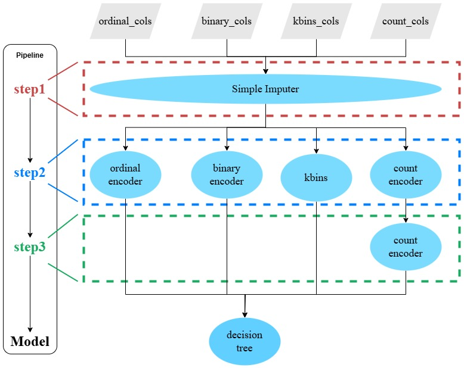
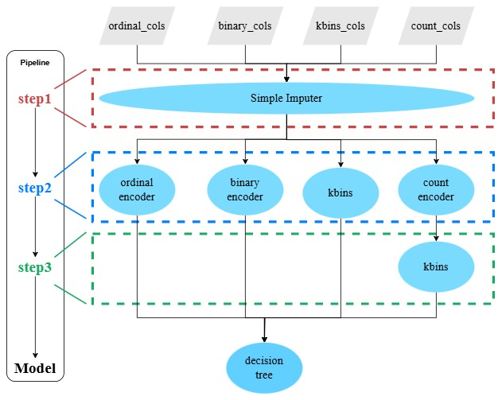

# Craftsman: Machine Learning Inference Pipeline Execution Using Pure SQL Based on Operator Fusion

## Project Introduction
Craftsman is a tool to translate an ML inference pipeline into a pure SQL query. It is easily ported to different databases, enabling databases that do not support Python UDF, such as TiDB, to efficiently execute ML pipelines natively. 


## Quaik Start

We use price prediction as an example and briefly introduce how to build and train an ML pipeline , and how to translate the trained pipeline into pure SQL, to execute the pipeline in databases natively.

### Step1: Prepare dataset in database
```sql
-- Example for duckdb
-- create table
CREATE TABLE car_price (
"Name" VARCHAR(25),
"Location" VARCHAR(15),
"Year" INT,
"Kilometers_Driven" INT,
"Fuel_Type" VARCHAR(10),
"Transmission" VARCHAR(10),
"Owner_Type" VARCHAR(20),
"Mileage" DOUBLE PRECISION,
"Engine" INT,
"Power" DOUBLE PRECISION,
"Seats" INT,
"Price" DOUBLE PRECISION,
"Brand" VARCHAR(25)
);
-- insert data
COPY car_price FROM '/dataset/Car_price/test.csv' DELIMITERS ',' csv header;
```

###  Step2: Build and train a pipeline using API of Craftsman

For detailed code on constructing and training pipelines, refer to `./tutorial.ipynb`.

The structure of the built pipeline is as follows.

<!--  -->




### Step3: Translate the trained pipeline into pure SQL query
```
from craftsman.transformer_manager import TransformerManager
import os

manager = TransformerManager()
table_name = "car_price"
dbms = 'duckdb'
pre_sql = "EXPLAIN ANALYZE "
group = 'prune'

query = manager.generate_query(
    pipeline_save_path,
    table_name,
    dbms,
    pre_sql=pre_sql,
    group=group,
    cost_model='craftsman'
)
```

The part of generated SQL is as follows, see `./tutorial/tutorial.sql` for the complete SQL.

```
EXPLAIN ANALYZE
SELECT
    CASE
        WHEN "Power" <= 150.0 THEN CASE
            WHEN "Engine" <= 1999.0 THEN CASE
                WHEN "Year" <= 2015.0 THEN CASE
                    WHEN "Year" <= 2013.0 THEN CASE
                        WHEN "Brand" <= 58.5 THEN CASE

    ...
    ...
    ...

      FROM
      (
          SELECT
              "Owner_Type",
              "Location",
              "Fuel_Type",
              "Transmission",
              "Name",
              COALESCE("Year", 2014.0) AS "Year",
              "Kilometers_Driven",
              COALESCE("Engine", 1197.0) AS "Engine",
              COALESCE("Power", 74.0) AS "Power",
              "Mileage",
              "Seats",
              "Brand"
          FROM
              car_price
      ) AS data
) AS data

```


### Step4: Execute SQL in different database(duckdb, postgres, clickhouse, monetdb, tidb)
```shell
# Example for duckdb
# open duckdb client
duckdb path/to/duckdb-file
# execute sql
.read path/to/sql-file.sql
```


## Datasets Links

| Dataset | Link |
|:---:|:---:|
| Credit Card | https://www.kaggle.com/datasets/mlg-ulb/creditcardfraud |
| Hospital | https://github.com/Microsoft/r-server-hospital-length-of-stay |
| Price | https://www.kaggle.com/datasets/avikasliwal/used-cars-price-prediction |
| Cat | https://www.kaggle.com/c/cat-in-the-dat/data |
| Criteo | https://ailab.criteo.com/ressources/ |


## Code Structure
- `craftsman/base/` directory contains the definitions of the main data structures.
- `craftsman/cost_model/` directory contains data structures related to the cost model.
- `craftsman/model/` directory contains the definitions of supported machine learning models.
- `craftsman/preprocess/` directory contains the definitions of supported preprocessing operators.
- `craftsman/rule_based_optimize/` directory contains the logic for operator fusion.
- `craftsman/utility/` directory contains utility functions and the definition of preprocessing operators wrapped by craftsman.
- `craftsman/transformer_manager.py` file contains the entry function `TransformerManager.generate_query()`, which includes the SQL assembly logic.